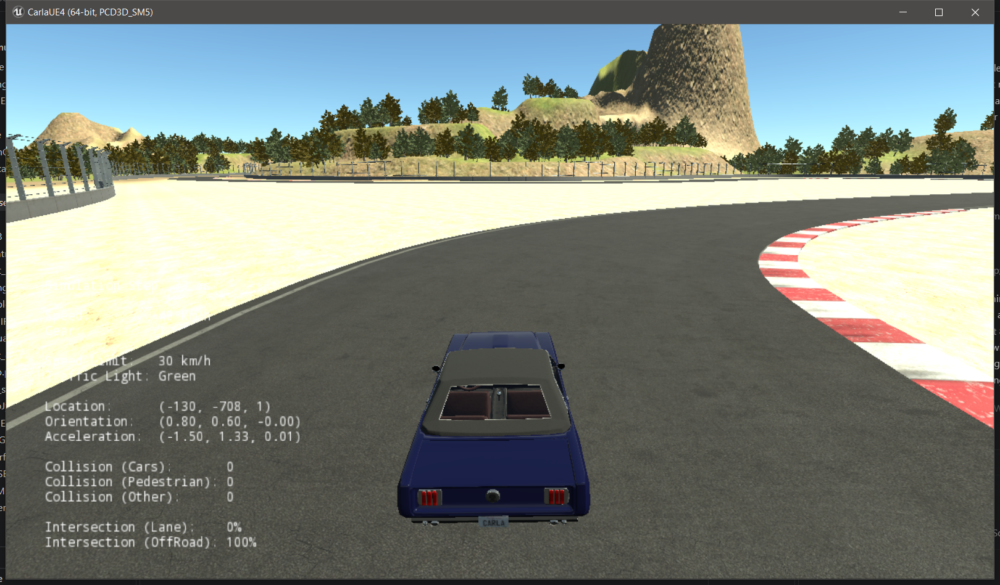
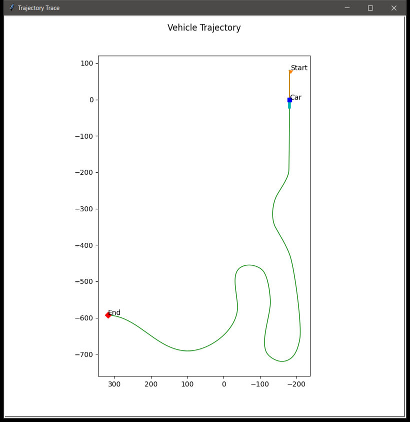
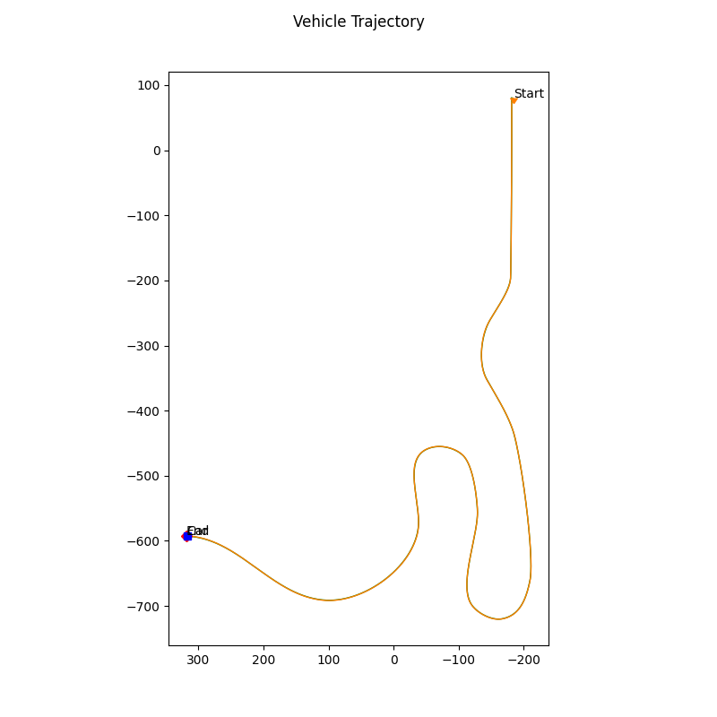
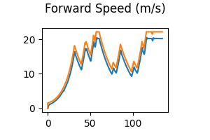
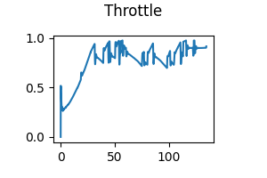
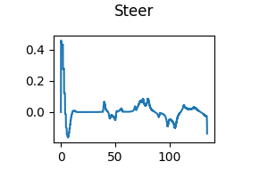

# Self-Driving Vehicle Control with CARLA

This repository contains my controller implementation for CARLA 0.8.4 and the
Coursera **Introduction to Self-Driving Cars** final project. The objective is
to follow the RaceTrack waypoints while tracking the desired speed associated
with each waypoint. The CARLA simulator binaries are not included.

The controller is implemented in
`PythonClient/Course1FinalProject/controller2d.py`.

## Simulation demo

The following screenshots were captured while running the controller on the
CARLA 0.8.4 RaceTrack map.

### CARLA RaceTrack simulation



### Live trajectory tracking



### Final controller plots

| Completed trajectory | Desired and actual speed |
| :---: | :---: |
|  |  |

| Throttle output | Steering output |
| :---: | :---: |
|  |  |

## My controller idea

My design separates vehicle control into three parts:

1. A high-level PID controller converts speed error into desired longitudinal
   acceleration.
2. A low-level longitudinal vehicle model converts desired acceleration into
   mutually exclusive throttle or brake commands.
3. A Pure Pursuit controller uses the vehicle pose and upcoming waypoints to
   calculate the steering angle.

The longitudinal-control hierarchy is:

```text
CARLA vehicle speed + waypoint desired speed
    -> speed error
    -> high-level PID
    -> desired acceleration
    -> longitudinal dynamic model
    -> throttle or brake
```

The lateral-control path is:

```text
CARLA x, y, yaw + upcoming waypoints
    -> speed-dependent lookahead target
    -> Pure Pursuit
    -> steering angle
```

## Longitudinal control

The speed error is:

```text
speed_error = desired_speed - current_speed
```

The high-level PID produces desired acceleration rather than throttle:

```text
a_desired = Kp * speed_error
          + Ki * integral(speed_error)
          + Kd * derivative(speed_error)
```

The implementation validates the timestamp difference, limits the derivative,
clamps the accumulated error, and uses conditional integration to prevent
integral windup. Desired acceleration is limited to `[-5.0, 3.0] m/s^2`.

Final PID gains:

| Parameter | Value |
| --- | ---: |
| Kp | 1.00 |
| Ki | 0.08 |
| Kd | 0.05 |

The low-level controller uses the approximate force balance:

```text
F_roll     = Crr * mass * gravity
F_drag     = 0.5 * air_density * Cd * frontal_area * speed^2
F_required = mass * a_desired + F_roll + F_drag
```

Positive required force is normalized into throttle. Negative required force
is normalized into brake. The two actuators are never commanded together.

| Dynamic-model parameter | Value |
| --- | ---: |
| Vehicle mass | 1500 kg |
| Rolling resistance coefficient | 0.015 |
| Air density | 1.225 kg/m^3 |
| Drag coefficient | 0.30 |
| Frontal area | 2.20 m^2 |
| Maximum drive force | 5000 N |
| Maximum brake force | 12000 N |

## Lateral control

Pure Pursuit selects a target by walking forward along the local waypoint path
until it reaches a speed-dependent lookahead distance:

```text
lookahead = clamp(3.0 + 0.35 * speed, 3.0, 10.0) meters
```

The CARLA measurement is treated as the vehicle center. The controller shifts
the control point 1.5 meters backward to the estimated rear axle and assumes a
3.0-meter wheelbase. After transforming the target into the vehicle frame, the
steering angle is calculated as:

```text
steering = atan2(2 * wheelbase * sin(alpha), target_distance)
```

Steering is limited to `[-1.22, 1.22]` radians. The provided `set_steer()`
method converts this angle into CARLA's normalized steering command.

## Running the project

Download and extract CARLA 0.8.4, then copy this repository's
`PythonClient/Course1FinalProject` directory into the CARLA installation's
`PythonClient` directory.

Start CARLA from the CARLA installation root using the RaceTrack map and a
fixed 30 Hz simulation step:

```powershell
CarlaUE4.exe /Game/Maps/RaceTrack -windowed -ResX=640 -ResY=480 -quality-level=Low -carla-server -benchmark -fps=30
```

In another terminal, run the client with Python 3.6:

```powershell
cd PythonClient\Course1FinalProject
py -3.6 module_7.py
```

If Python 3.6 is installed but not registered with the Python launcher, invoke
its `python.exe` directly.

The trajectory and feedback plots are written to
`PythonClient/Course1FinalProject/controller_output/`.

Run the grader with:

```powershell
py -3.6 grade_c1m7.py racetrack_waypoints.txt controller_output\trajectory.txt
```

## Verified result

The final controller was tested in CARLA on RaceTrack and passed **100.00% of
the waypoints (1724/1724)**. The assignment requires at least 50%.

| Metric | Result |
| --- | ---: |
| Completion time | 134.722 simulated seconds |
| Median path error | 0.210 m |
| 95th-percentile path error | 0.399 m |
| Maximum path error | 2.470 m |
| Mean speed error | 1.800 m/s |
| Maximum speed error | 2.877 m/s |

## Simulator dependency

This project requires the separately downloaded CARLA 0.8.4 simulator and its
legacy Python client. The original CARLA documentation is available at
<http://carla.readthedocs.io>.
